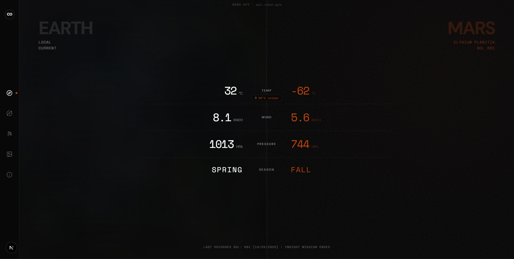
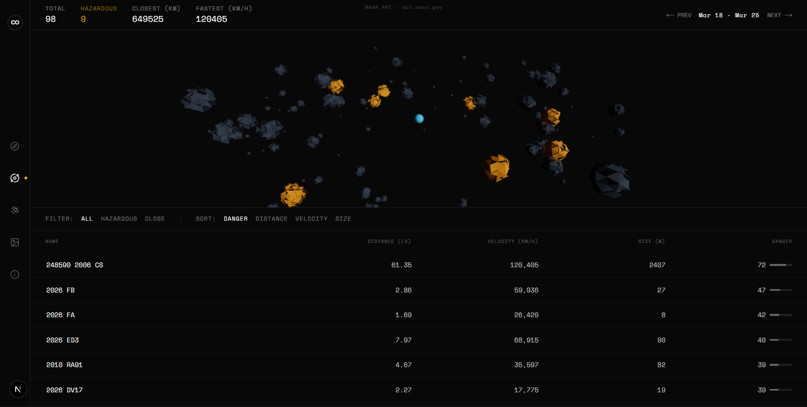
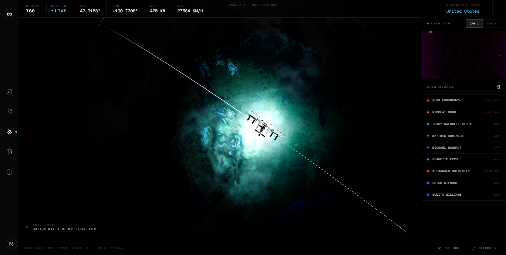
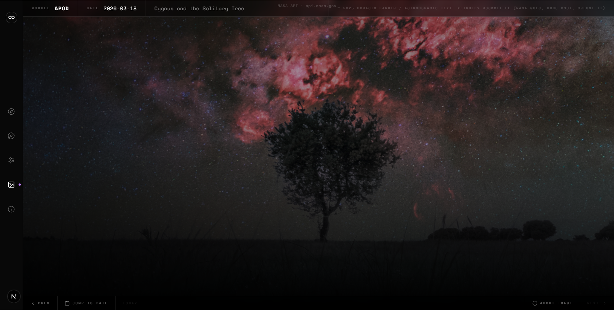
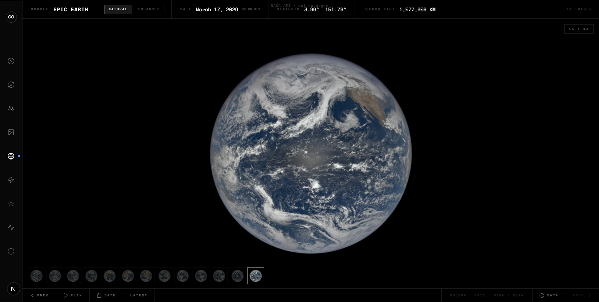
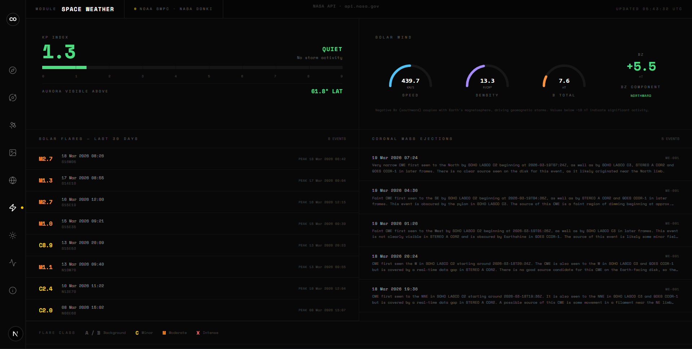
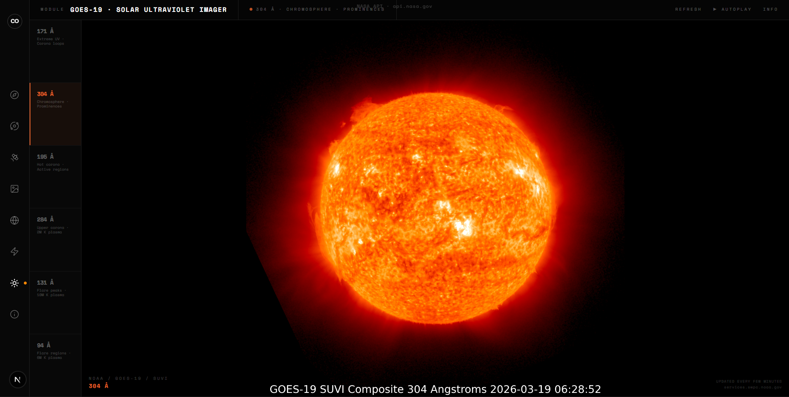
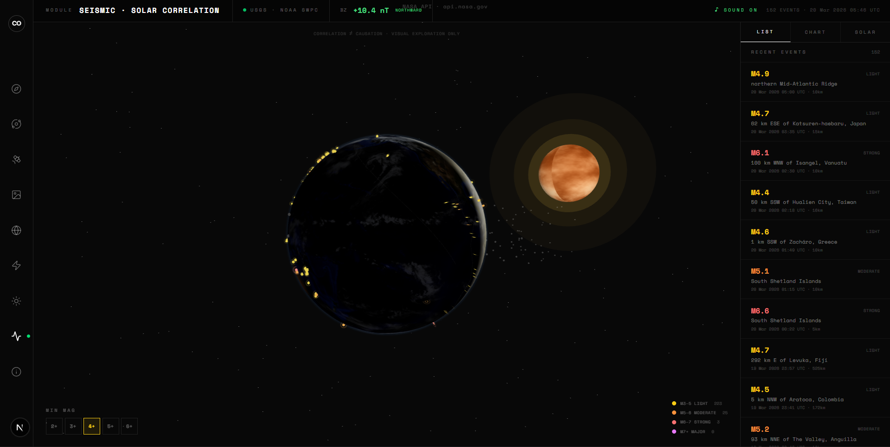

# COSMOS EXPLORER

```
  ██████╗ ██████╗ ███████╗███╗   ███╗ ██████╗ ███████╗
 ██╔════╝██╔═══██╗██╔════╝████╗ ████║██╔═══██╗██╔════╝
 ██║     ██║   ██║███████╗██╔████╔██║██║   ██║███████╗
 ██║     ██║   ██║╚════██║██║╚██╔╝██║██║   ██║╚════██║
 ╚██████╗╚██████╔╝███████║██║ ╚═╝ ██║╚██████╔╝███████║
  ╚═════╝ ╚═════╝ ╚══════╝╚═╝     ╚═╝ ╚═════╝ ╚══════╝
```

> A brutalist real-time space data terminal. Live telemetry from NASA, NOAA, USGS, and open-source APIs — rendered in the browser.

[](LICENSE)
[](https://nextjs.org)
[](https://threejs.org)

---

## PREVIEW

| MARS WEATHER | NEO TRACKER |
|:---:|:---:|
|  |  |

| ISS LIVE | APOD |
|:---:|:---:|
|  |  |

| EPIC EARTH | SPACE WEATHER |
|:---:|:---:|
|  |  |

| GOES-19 SDO | SEISMIC · SOLAR |
|:---:|:---:|
|  |  |

---

## MODULES

```
01 / MARS         — Atmospheric telemetry from NASA InSight at Elysium Planitia
                    vs. your local Earth weather in real time.

02 / NEO          — 7-day asteroid feed from NASA NeoWs. 3D orbital simulation,
                    danger scoring, hazard filtering.

03 / ISS          — Live ISS position polled every 5s on a 3D Earth globe with
                    cloud layer, orbital trails, crew manifest, and live HDTV.

04 / APOD         — Full-viewport Astronomy Picture of the Day. Date picker
                    spanning the entire archive: Jun 16 1995 → today.

05 / EPIC         — Full-disk Earth imagery from NASA DSCOVR at L1 Lagrange point.
                    Natural/enhanced color, filmstrip scrubber, autoplay timelapse.

06 / SOLAR        — Real-time space weather from NOAA SWPC + NASA DONKI. Kp index,
                    solar wind plasma/mag, solar flares, CMEs, aurora predictions.

07 / SDO          — GOES-19 SUVI solar imager. 6 EUV wavelengths (94–304 Å),
                    updated every few minutes. Autoplay + wavelength guide.

08 / QUAKE        — USGS earthquake feed (M2.5+, 7 days) on 3D Earth with tectonic
                    plates. Overlays NOAA solar wind Bz. Synthetic seismograms,
                    audio synthesis, depth diagrams, magnitude timeline.
```

---

## STACK

```
Framework   Next.js 15 (App Router · RSC · Streaming)
3D          Three.js · React Three Fiber · Drei
Animation   Motion (Framer Motion)
Styling     Tailwind CSS v4
Language    TypeScript (strict)
Deployment  Edge Runtime · ISR · NOAA/DONKI proxy
```

---

## DATA SOURCES

```
NASA InSight API        api.nasa.gov/insight_weather              Mars atmospheric data
NASA NeoWs              api.nasa.gov/neo/rest/v1                  Near Earth Objects
NASA APOD               api.nasa.gov/planetary/apod               Astronomy Picture of the Day
NASA EPIC               api.nasa.gov/EPIC/api/natural             Full-disk Earth imagery
NASA DONKI              api.nasa.gov/DONKI                        Solar flares · CMEs
NOAA SWPC               services.swpc.noaa.gov/products           Solar wind · Kp index
NOAA GOES-19 SUVI       services.swpc.noaa.gov/images/suvi        Solar UV imagery
USGS Earthquake Feed    earthquake.usgs.gov/earthquakes/feed      Real-time seismic events
WhereTheISS.at          api.wheretheiss.at/v1                     ISS real-time position
Open-Notify             api.open-notify.org/astros                ISS crew manifest
Open-Meteo              api.open-meteo.com/v1/forecast            Local Earth weather
Nominatim / OSM         nominatim.openstreetmap.org               ISS reverse geocoding
```

All APIs are free and open. No backend required beyond Next.js API routes for CORS proxying.

---

## GETTING STARTED

**Prerequisites:** Node.js 18+

**1. Clone**
```bash
git clone https://github.com/thor-op/cosmos.git
cd cosmos
```

**2. Install**
```bash
npm install
```

**3. Configure**
```bash
cp .env.example .env.local
```
Edit `.env.local` and set your NASA API key.
Get a free key at [api.nasa.gov](https://api.nasa.gov) — takes 30 seconds.

```env
NEXT_PUBLIC_NASA_API_KEY="your_key_here"
```

> `DEMO_KEY` works but is rate-limited to 30 req/hour per IP.

**4. Run**
```bash
npm run dev
```

Open [http://localhost:3000](http://localhost:3000).

---

## PROJECT STRUCTURE

```
cosmos/
├── app/
│   ├── api/
│   │   ├── crew/route.ts           # ISS crew proxy (1h cache)
│   │   └── space-weather/route.ts  # NOAA SWPC proxy (CORS workaround)
│   ├── layout.tsx
│   └── page.tsx
├── components/
│   ├── About.tsx                   # About / credits page
│   ├── Apod.tsx                    # Astronomy Picture of the Day
│   ├── CountUp.tsx                 # Animated number component
│   ├── EpicEarth.tsx               # EPIC full-disk Earth imagery
│   ├── IssTracker.tsx              # ISS live tracker + 3D globe
│   ├── MarsWeather.tsx             # Mars vs Earth weather
│   ├── NeoTracker.tsx              # Near Earth Object tracker
│   ├── QuakeTracker.tsx            # Earthquake + solar correlation
│   ├── SdoViewer.tsx               # GOES-19 solar imager
│   ├── SpaceWeather.tsx            # NOAA/DONKI space weather
│   └── Sidebar.tsx                 # Navigation
├── public/
│   └── earth-clouds.png            # Cloud texture (local, avoids CORS)
└── .env.example
```

---

## FEATURES

- **Real-time data** — ISS position every 5s, NOAA solar wind every 60s, USGS quakes every 5min
- **3D visualization** — Earth globes with textures, clouds, atmosphere, orbital mechanics
- **Audio synthesis** — Earthquake waveforms sonified via Web Audio API
- **Procedural shaders** — Sun surface with FBM noise, limb darkening, animated corona
- **Brutalist aesthetic** — Monospace fonts, terminal panels, edge-anchored HUDs, no rounded cards
- **Fully client-side** — No database, no auth, just static + API routes

---

## LICENSE

```
COSMOS EXPLORER
Copyright (C) 2026  THORXOP (github.com/thor-op)

This program is free software: you can redistribute it and/or modify
it under the terms of the GNU Affero General Public License as published
by the Free Software Foundation, either version 3 of the License, or
(at your option) any later version.

This program is distributed in the hope that it will be useful,
but WITHOUT ANY WARRANTY; without even the implied warranty of
MERCHANTABILITY or FITNESS FOR A PARTICULAR PURPOSE. See the
GNU Affero General Public License for more details.
```

Full license text: [LICENSE](LICENSE)

---

<sub>Built by [THORXOP](https://github.com/thor-op) · Data provided by NASA · NOAA · USGS · OSM · Open-Meteo</sub>
